# Cryptomator: virtuelle Laufwerke und Mount-Verträge

Abgerufen und geprüft: **2026-10-04**. Gegenstand: Desktop-Mounts mit Schwerpunkt Windows, Plattformunterschiede und übertragbare Konzepte für einen Rust-Datei-Explorer. Reine Quellenrecherche, ohne Implementierungsplan, lokale Builds oder Laufzeitversuche. Aussagen über beobachtetes Verhalten stammen aus Quellcode und Primärdokumentation; daraus abgeleitete Folgerungen sind ausdrücklich gekennzeichnet. Der Bericht prüft weder die Smart-Explorer-Implementierung noch das Cryptomator-Vaultformat vollständig.

**Ergebnis:** Cryptomator stellt unter Windows ein virtuelles Dateisystem über WinFsp bereit. Verschlüsselung und Laufwerksdarstellung sind getrennte Schichten; die anderen Plattformen verwenden eigene Adapter. Für Smart Explorer sind insbesondere diese Trennung, ein überprüfter Mount-Bereitschaftszustand und ein präziser Flush-/Unmountvertrag übertragbar. Der [ergänzende Vault-Bericht](../CRYPTOMATOR_VAULTS_ERKUNDUNG.md) bewertet die konkreten Anschlussstellen im Projekt.

## 1. Untersuchte Stände

Die Release-Auswahl wurde über GitHubs REST-Endpunkt `repos/<owner>/<repo>/releases/latest` geprüft; die Commit-SHAs der Tags über `repos/<owner>/<repo>/commits/<tag>`. Eine aktuelle Bibliotheksrelease ist nicht automatisch die im Desktop enthaltene Version.

| Komponente | Für die Aussagen maßgeblicher Stand | Commit-SHA |
|---|---|---|
| [Cryptomator Desktop](https://github.com/cryptomator/cryptomator/releases/tag/1.19.3) | 1.19.3, veröffentlicht 2026-06-29; beim Abruf neuester stabiler GitHub-Release | `fc76f5f83f6f4d3356f3bd161e27719372e1fc74` |
| [FUSE-NIO-Adapter](https://github.com/cryptomator/fuse-nio-adapter/tree/6.0.1) | 6.0.1, Desktop-Abhängigkeit und beim Abruf neuester stabiler GitHub-Release | `2ee34ceef99de7909ab5a3d58f296d2caabdc2e4` |
| [jFUSE](https://github.com/cryptomator/jfuse/tree/0.7.3) | 0.7.3, Abhängigkeit von FUSE-NIO 6.0.1; neuester GitHub-Release | `c782a16deaceaae8b342e80e13e702965c14b4a6` |
| [Integrations API](https://github.com/cryptomator/integrations-api/tree/1.9.0) | 1.9.0, vom Desktop direkt referenziert; aktueller separater Release beim Abruf 1.9.1 | `d092fa76f54471d39861544fac0f3898ac25de21` |
| [WebDAV-NIO-Adapter](https://github.com/cryptomator/webdav-nio-adapter/tree/3.0.2) | 3.0.2, Desktop-Abhängigkeit; aktueller separater Release beim Abruf 3.0.3 | `1052d27a6d752790629f322f7c1cc151cd800c99` |
| [WinFsp](https://github.com/winfsp/winfsp/releases/tag/v2.1) | v2.1, beim Abruf neuester stabiler GitHub-Release | `ddca7bd5481857a65ba552f643b8776fd070836f` |
| [libfuse](https://github.com/libfuse/libfuse/releases/tag/fuse-3.18.3) | 3.18.3, aktueller stabiler Stand zum Vergleich der FUSE-Verträge; kein Nachweis der auf einem Cryptomator-Rechner installierten Version | `3dbcfce64ba0dd529cec7b94305662e7901a991b` |
| [Cryptomator Android](https://github.com/cryptomator/android/releases/tag/2.0.1) | 2.0.1, veröffentlicht 2026-07-31; beim Abruf neuester stabiler GitHub-Release | `27c4341ea02fbdc8b99ed640601ad3edb5dadbe0` |

Zusätzlich gezielt untersuchte Entwicklungsstände:

| Repository/Branch | SHA | Zweck |
|---|---|---|
| Desktop `develop` | `80da593723202f6244813cf396a671005fae88f1` | Trennung vom veröffentlichten Desktop |
| FUSE-NIO `develop` | `bde6789aef42423255db1e475082449f6c07041f` | Windows-Treibererkennung über direkte Registry-API |
| jFUSE `develop` | `f3b56a597ab0135f229cb7b24fdf0c9f525119a8` | 0.8.0-SNAPSHOT/JDK-Anforderung des aktuellen README |
| WebDAV-NIO `develop` | `b94c5a8a163a4cd6ef18e36227fbd82b5235d4f8` | Versionsabgrenzung gegenüber Desktop 3.0.2 |
| Integrations API `develop` | `ff803cb19dba00959178717334836e6d183d3659` | Versionsabgrenzung |
| Android `develop` | `868730f53c11c0a2ae3574b977fa5e0016d0ecab` | Versionsabgrenzung; Android-Aussagen unten beziehen sich auf 2.0.1 |
| WinFsp `master` | `ebd50e1956dbf7c12db5b897fa9af5dce8f61675` | Versionsabgrenzung; operative API-Belege unten aus v2.1 |
| libfuse `master` | `eb7bae84508c520bdcedcfd88175c5afe4c82ecb` | Versionsabgrenzung; Vertragsbelege unten aus 3.18.3 |

Der [Desktop-POM 1.19.3](https://github.com/cryptomator/cryptomator/blob/fc76f5f83f6f4d3356f3bd161e27719372e1fc74/pom.xml#L29-L44) nennt JDK 26, CryptoFS 2.10.0, FUSE-NIO 6.0.1, WebDAV-NIO 3.0.2 und Integrations API 1.9.0. Der [FUSE-NIO-POM 6.0.1](https://github.com/cryptomator/fuse-nio-adapter/blob/2ee34ceef99de7909ab5a3d58f296d2caabdc2e4/pom.xml#L20-L24) nennt JDK 25, jFUSE 0.7.3 und Integrations API 1.7.0. Damit ist eine transitive Bibliotheksdeklaration von der direkten Desktop-Abhängigkeit zu unterscheiden. Binärpakete und deren tatsächlich aufgelöste Modullisten wurden nicht extrahiert.

## 2. Was Cryptomator unter einem virtuellen Laufwerk versteht

Cryptomator exportiert einen bereits vorhandenen Java-NIO-Dateisystempfad. Der Desktop übergibt den `cryptoFsRoot` an `mountService.forFileSystem(...)`; der Mount-Adapter kennt einen `java.nio.file.Path`, nicht das gesamte UI oder den Schlüsselworkflow. Windows erhält eine dateisystemartige Darstellung über WinFsp; der untersuchte Pfad implementiert kein VHD-, BitLocker- oder Sektor-/Blockgerät. [Desktop-Mounter](https://github.com/cryptomator/cryptomator/blob/fc76f5f83f6f4d3356f3bd161e27719372e1fc74/src/main/java/org/cryptomator/common/mount/Mounter.java#L159-L173), [WinFsp-Architektur](https://winfsp.dev/doc/WinFsp-Design/).

```mermaid
flowchart LR
  App[Explorer oder andere Windows-App] --> WinAPI[Win32 / NT Datei-I/O]
  WinAPI --> Driver[WinFsp-Dateisystemtreiber]
  Driver --> DLL[WinFsp-DLL mit FUSE3-Kompatibilität]
  DLL --> FFM[jFUSE 0.7.3 / Java FFM]
  FFM --> Adapter[FUSE-NIO-Adapter 6.0.1]
  Adapter --> NIO[Java NIO Path / FileChannel]
  NIO --> Crypto[CryptoFS-Dateisystem]
  Crypto --> Storage[Verschlüsselte Ablage]
```

Das Diagramm beschreibt den Datei-I/O-Weg des Desktop-WinFsp-Mounts; HTTP/WebDAV läuft über einen anderen Adapter. WinFsp besteht aus einem Kernel-Dateisystemtreiber und einer Userspace-DLL. Der Treiber verarbeitet Windows-I/O-Anfragen und reicht erforderliche Operationen an den Dateisystemprozess weiter; gecachte Operationen können im Kernel beantwortet werden. Disk- und Netzwerkdarstellung sind unterschiedliche WinFsp-Volume-Typen. Der Netzwerktyp wird beim Windows-MUP registriert. Ein UNC-artiger Mount bedeutet hier deshalb weder einen SMB-Server noch eine über das LAN freigegebene Entschlüsselung. [WinFsp Design](https://winfsp.dev/doc/WinFsp-Design/), [Netzwerkprovider](https://github.com/cryptomator/fuse-nio-adapter/blob/2ee34ceef99de7909ab5a3d58f296d2caabdc2e4/src/main/java/org/cryptomator/frontend/fuse/mount/WinFspNetworkMountProvider.java#L80-L85).

## 3. Belastbare Windows-Mountkette

### Provider, Konfiguration und native Bindung

Die Integrations API lädt Provider zur Laufzeit. `MountService` meldet Unterstützung und Fähigkeiten; `forFileSystem(Path)` liefert einen Builder; `mount()` liefert ein Lebenszyklusobjekt. Unbekannte optionale Builder-Funktionen dürfen mit `UnsupportedOperationException` scheitern. Das Ergebnis `Mountpoint` ist typisiert als Pfad oder URI. So muss ein reiner HTTP-Endpunkt nicht als lokaler Dateipfad ausgegeben werden. [Provider-API](https://github.com/cryptomator/integrations-api/blob/d092fa76f54471d39861544fac0f3898ac25de21/src/main/java/org/cryptomator/integrations/mount/MountService.java), [Builder](https://github.com/cryptomator/integrations-api/blob/d092fa76f54471d39861544fac0f3898ac25de21/src/main/java/org/cryptomator/integrations/mount/MountBuilder.java), [Mountpoint](https://github.com/cryptomator/integrations-api/blob/d092fa76f54471d39861544fac0f3898ac25de21/src/main/java/org/cryptomator/integrations/mount/Mountpoint.java).

Der Windows-Provider findet die WinFsp-DLL, setzt ihren Pfad am `Fuse.builder()`, baut einen `ReadWriteAdapter` und ruft `fuse.mount(...)` auf. Windows-xattrs werden dort ausdrücklich abgeschaltet. Der Read-only-Modus setzt in den kombinierten Flags `umask=0333`; eine vollständig geprüfte Read-only-Sicherheitsgrenze über alle Windows-Operationen folgt daraus allein nicht. [WinFspMountProvider 6.0.1](https://github.com/cryptomator/fuse-nio-adapter/blob/2ee34ceef99de7909ab5a3d58f296d2caabdc2e4/src/main/java/org/cryptomator/frontend/fuse/mount/WinFspMountProvider.java#L104-L133).

jFUSE 0.7.3 lädt die DLL mit `System.load`. Die Windows-Implementierung benutzt generierte FFM-Bindungen an `fuse3_new`, `fuse3_mount`, `fuse3_loop` beziehungsweise `fuse3_loop_mt_31`. Die `fuse_operations`-Callbacks sind Upcalls in Java. Das ist keine von Cryptomator handgeschriebene JNI-C/C++-Brücke pro Dateisystemoperation. Die Mehrthreadvariante weicht laut Code wegen jFUSE-Issue #31 von der neueren Loop-Signatur ab. [WinFuseBuilder](https://github.com/cryptomator/jfuse/blob/c782a16deaceaae8b342e80e13e702965c14b4a6/jfuse-win/src/main/java/org/cryptomator/jfuse/win/WinFuseBuilder.java#L35-L48), [FuseImpl](https://github.com/cryptomator/jfuse/blob/c782a16deaceaae8b342e80e13e702965c14b4a6/jfuse-win/src/main/java/org/cryptomator/jfuse/win/FuseImpl.java#L35-L51), [Loop/Unmount](https://github.com/cryptomator/jfuse/blob/c782a16deaceaae8b342e80e13e702965c14b4a6/jfuse-win/src/main/java/org/cryptomator/jfuse/win/FuseMountImpl.java).

Die Treibererkennung unterscheidet sich nach Stand: 6.0.1 führt `reg.exe query HKLM\SOFTWARE\WOW6432Node\WinFsp /v InstallDir` aus und fällt bei Fehlern auf `C:\Program Files (x86)\WinFsp\` zurück. Es wählt `winfsp-x64.dll` beziehungsweise `winfsp-a64.dll` und prüft zunächst deren Existenz. Der untersuchte `develop`-Stand benutzt stattdessen FFM mit `Advapi32.dll`/`RegGetValueW`. Ein Existenzcheck ist kein Beweis für erfolgreiches Laden, passenden ABI-Stand oder einen laufenden Treiber. [Release WinFspUtil](https://github.com/cryptomator/fuse-nio-adapter/blob/2ee34ceef99de7909ab5a3d58f296d2caabdc2e4/src/main/java/org/cryptomator/frontend/fuse/mount/WinFspUtil.java), [develop WinFspUtil](https://github.com/cryptomator/fuse-nio-adapter/blob/bde6789aef42423255db1e475082449f6c07041f/src/main/java/org/cryptomator/frontend/fuse/mount/WinFspUtil.java#L51-L81).

### Laufwerksbuchstabe, Ordner und Netzwerkdarstellung

| Cryptomator-Provider 6.0.1 | Mountziel | Besonderheit |
|---|---|---|
| `WinFspMountProvider`, Anzeige „WinFsp (Local Drive)“ | Laufwerksbuchstabe oder **noch nicht existierender** Knoten in einem existierenden Elternordner | Diskartige Darstellung; Verzeichnis-Mount erlaubt |
| `WinFspNetworkMountProvider`, Anzeige „WinFsp“ | Laufwerksbuchstabe | `-oUNC=/localhost/<volumeId>/<volumeName>`; anderer erlaubter Hostname konfigurierbar |
| `WindowsMounter` für WebDAV | gewählter oder systemseitig zugeteilter Buchstabe | `net use ... /persistent:no`; eigener WebDAV-Pfad |

Diese Regeln sind konkrete Providerverträge, kein einheitliches „beliebigen leeren Ordner auswählen“. Der Netzwerkprovider verwirft frühere `VolumePrefix`-/`UNC`-Flags und bildet den Prefix aus Host, Volume-ID und Name. Der lokale Provider verlangt den nicht existierenden Child; der Desktop besitzt ergänzende Vorbereitung/Cleanup für Mounts innerhalb eines Parents. [Lokaler Provider](https://github.com/cryptomator/fuse-nio-adapter/blob/2ee34ceef99de7909ab5a3d58f296d2caabdc2e4/src/main/java/org/cryptomator/frontend/fuse/mount/WinFspMountProvider.java#L75-L83), [Netzwerkprovider](https://github.com/cryptomator/fuse-nio-adapter/blob/2ee34ceef99de7909ab5a3d58f296d2caabdc2e4/src/main/java/org/cryptomator/frontend/fuse/mount/WinFspNetworkMountProvider.java#L60-L85), [Desktop-Vorbereitung](https://github.com/cryptomator/cryptomator/blob/fc76f5f83f6f4d3356f3bd161e27719372e1fc74/src/main/java/org/cryptomator/common/mount/Mounter.java#L104-L154).

WinFsp erklärt die Plattformgrenze: Directory-Mounts sind für Disk-Dateisysteme möglich, für Netzwerkdateisysteme wegen Windows-Junction-Einschränkungen nicht. `FspFileSystemSetMountPoint(NULL)` kann selbst einen freien Buchstaben ab Z wählen; dies ist eine WinFsp-API-Fähigkeit und nicht die konkrete Auswahlstrategie des Desktop-Mounters. [WinFsp-Mount-API](https://winfsp.dev/doc/WinFsp-API-winfsp.h/#fspfilesystemsetmountpoint).

Cryptomators Nutzerdokumentation beschreibt Buchstaben-Mounts als nur für den aktuellen Nutzer erreichbar; für andere beziehungsweise erhöhte Nutzer nennt sie „Local Drive“ mit Directory-Mount. Das ist keine Erlaubnis, Rechteprüfungen im exportierten Backend zu umgehen. Treiberinstallation und täglicher Mount sind ebenfalls getrennte Vorgänge; die EXE-Ausgabe installiert WinFsp laut Dokumentation mit. [Cryptomator Volume Types](https://docs.cryptomator.org/desktop/volume-type/#winfsp--winfsp-local-drive).

## 4. Lebenszyklus, offene Ressourcen und Dauerhaftigkeit

### Mount-Erfolg und Unmount

jFUSE 0.7.3 verwaltet eine nicht wiederverwendbare Session, Shared-Arena, Zustandsreferenz und einen eigenen Loop-Executor. Es erzwingt `-f`, damit die native Bibliothek nicht den Java-Prozess daemonisiert. Nach dem nativen Mount startet der Loop; ein Dateiattributzugriff auf `/jfuse_mount_probe` muss im Java-Callback ankommen. Erst dann gilt der Mount als zugänglich. Die Probe muss keine reale Datei finden. Ein allgemeines zeitliches Mount-Limit ist in der gelesenen Warteschleife nicht erkennbar; sie endet über Probe, Loop-Ende oder Unterbrechung. `close()` unmountet, wartet höchstens zehn Sekunden auf den Loop, zerstört den nativen Mount und gibt die Arena frei. [jFUSE Fuse 0.7.3](https://github.com/cryptomator/jfuse/blob/c782a16deaceaae8b342e80e13e702965c14b4a6/jfuse-api/src/main/java/org/cryptomator/jfuse/api/Fuse.java#L109-L193).

Die Integrations API trennt `unmount()`, optionales `unmountForced()` und `close()` für Ressourcenfreigabe. Beim Windows-Provider ruft der normale Weg zunächst `isInUse()` auf und scheitert gegebenenfalls mit „Filesystem in use“; andernfalls folgt derselbe `fuse.close()`-Weg wie beim erzwungenen Unmount. `AbstractMount.close()` schließt zusätzlich den NIO-Adapter. Ein geschlossener WinFsp-Prozess verliert seine Volume-Handles, sodass Windows die entsprechenden Devices aufräumt; diese Aufräumfähigkeit garantiert keine erfolgreiche Speicherung vorheriger Nutzdaten. [Mount-Lifecycle-API](https://github.com/cryptomator/integrations-api/blob/d092fa76f54471d39861544fac0f3898ac25de21/src/main/java/org/cryptomator/integrations/mount/Mount.java), [Windows-Unmount](https://github.com/cryptomator/fuse-nio-adapter/blob/2ee34ceef99de7909ab5a3d58f296d2caabdc2e4/src/main/java/org/cryptomator/frontend/fuse/mount/WinFspMountProvider.java#L145-L159), [Adapter-Cleanup](https://github.com/cryptomator/fuse-nio-adapter/blob/2ee34ceef99de7909ab5a3d58f296d2caabdc2e4/src/main/java/org/cryptomator/frontend/fuse/mount/AbstractMount.java#L31-L39), [WinFsp Design](https://winfsp.dev/doc/WinFsp-Design/).

`isInUse()` versucht einen Write-Lock für `/` und prüft `openFiles.hasDirtyFiles()`. Ein unverändertes geöffnetes Lesefile allein gilt dabei nicht als dirty. Der eigene Vertrag warnt ausdrücklich, dass `false` keinen sicheren erfolgreichen Unmount garantiert und sofort veralten kann. [ReadOnlyAdapter](https://github.com/cryptomator/fuse-nio-adapter/blob/2ee34ceef99de7909ab5a3d58f296d2caabdc2e4/src/main/java/org/cryptomator/frontend/fuse/ReadOnlyAdapter.java#L379-L390), [FuseNioAdapter-Vertrag](https://github.com/cryptomator/fuse-nio-adapter/blob/2ee34ceef99de7909ab5a3d58f296d2caabdc2e4/src/main/java/org/cryptomator/frontend/fuse/FuseNioAdapter.java#L14-L24).

### Handle-Modell und Flush

Die NIO-Schicht vergibt eigene monotone `long`-Handle-IDs und hält eine ConcurrentMap auf `OpenFile`-Objekte mit `FileChannel`. `release` entfernt das Objekt und schließt seinen Channel; der globale Cleanup versucht alle übrig gebliebenen Channels und sammelt Close-Fehler. Damit bleibt ein geöffnetes File ein Objekt mit eigener Lebensdauer, statt bei jedem Read nur den ursprünglichen Namen erneut zu öffnen. Das allein beweist noch keine korrekte Rename-/Unlink-Semantik über sämtliche Backends. [OpenFileFactory](https://github.com/cryptomator/fuse-nio-adapter/blob/2ee34ceef99de7909ab5a3d58f296d2caabdc2e4/src/main/java/org/cryptomator/frontend/fuse/OpenFileFactory.java), [ReadOnlyFileHandler](https://github.com/cryptomator/fuse-nio-adapter/blob/2ee34ceef99de7909ab5a3d58f296d2caabdc2e4/src/main/java/org/cryptomator/frontend/fuse/ReadOnlyFileHandler.java#L57-L73).

`OpenFile.write` setzt `dirty=true`; `fsync(metaData)` ruft `channel.force(metaData)` auf und setzt dirty erst danach zurück. `ReadWriteAdapter.fsync` übersetzt `isdatasync == 0` in Metadaten-Flush. `OpenFile.truncate` setzt dagegen im gelesenen Stand kein dirty-Flag. Auch der Adapter-`fsync` nimmt dort keinen der sonst üblichen Path-/Data-Locks. **Belegter Prüfpunkt, kein bewiesener Datenverlust:** Die Busy-/Dirty-Heuristik darf nicht mit einer vollständigen Garantie für alle Mutationen und nebenläufigen Flushes verwechselt werden. [OpenFile](https://github.com/cryptomator/fuse-nio-adapter/blob/2ee34ceef99de7909ab5a3d58f296d2caabdc2e4/src/main/java/org/cryptomator/frontend/fuse/OpenFile.java#L79-L114), [Adapter-fsync](https://github.com/cryptomator/fuse-nio-adapter/blob/2ee34ceef99de7909ab5a3d58f296d2caabdc2e4/src/main/java/org/cryptomator/frontend/fuse/ReadWriteAdapter.java#L351-L364).

jFUSE kann `FLUSH`, `FSYNC` und `FSYNCDIR` binden; FUSE-NIO 6.0.1 registriert in den gelesenen ReadOnly-/ReadWrite-Sets `FSYNC`, jedoch weder `FLUSH` noch `FSYNCDIR`. Eine Fähigkeit der Bindung ist also nicht automatisch ein implementierter Vertrag des exportierten Dateisystems. Der Changelog führt `fsync` erst für FUSE-NIO 5.1.0 auf. [Operationen ReadOnly](https://github.com/cryptomator/fuse-nio-adapter/blob/2ee34ceef99de7909ab5a3d58f296d2caabdc2e4/src/main/java/org/cryptomator/frontend/fuse/ReadOnlyAdapter.java#L89-L111), [Operationen ReadWrite](https://github.com/cryptomator/fuse-nio-adapter/blob/2ee34ceef99de7909ab5a3d58f296d2caabdc2e4/src/main/java/org/cryptomator/frontend/fuse/ReadWriteAdapter.java#L58-L76), [jFUSE-Bindung](https://github.com/cryptomator/jfuse/blob/c782a16deaceaae8b342e80e13e702965c14b4a6/jfuse-win/src/main/java/org/cryptomator/jfuse/win/FuseImpl.java#L81-L112), [Changelog](https://github.com/cryptomator/fuse-nio-adapter/blob/2ee34ceef99de7909ab5a3d58f296d2caabdc2e4/CHANGELOG.md#L33-L35).

libfuse trennt `flush` von `fsync`: flush kann beim Schließen duplizierter Deskriptoren mehrfach vorkommen und ist kein automatisches Dauerhaftigkeitsversprechen. `release` kommt nach der letzten Referenz einschließlich Mappings; sein Rückgabewert wird ignoriert. Windows trennt ebenfalls Cleanup und endgültiges Close. WinFsp-Cleanup hat keinen Fehler-Rückgabekanal. Deshalb sind Close-/Release-Fehler keine ausreichende Basis für eine dem aufrufenden Editor bestätigte Speicherung. [libfuse-Vertrag](https://github.com/libfuse/libfuse/blob/3dbcfce64ba0dd529cec7b94305662e7901a991b/include/fuse.h#L514-L573), [WinFsp-Cleanup](https://winfsp.dev/doc/WinFsp-API-winfsp.h/).

Microsoft dokumentiert `FlushFileBuffers(HANDLE)` mit `GENERIC_WRITE` als Voraussetzung und unterscheidet Datei-Flush vom administrativen Volume-Flush. **Ableitung:** Bei einem entfernten oder verschlüsselten Backend muss der Erfolg bis zu dessen tatsächlichem Commit-/Durability-Vertrag durchgereicht werden. Die gelesene Mount-Schicht allein belegt weder Stromausfallsicherheit der Ablage noch erfolgte Cloud-Synchronisierung. [Microsoft FlushFileBuffers](https://learn.microsoft.com/en-us/windows/win32/api/fileapi/nf-fileapi-flushfilebuffers).

## 5. Locks, Cache, Watcher und Fehler

### Verschiedene Sperrarten

Der Adapter hat hierarchische Path-Locks und separate Data-Locks. Die LockManager-Caches benutzen Weak Values; sie sind Verwaltungsstrukturen für Synchronisationsobjekte, kein Nutzdaten-Cache. Die Sperren koordinieren die Adapteroperationen innerhalb dieser Instanz. [LockManager](https://github.com/cryptomator/fuse-nio-adapter/blob/2ee34ceef99de7909ab5a3d58f296d2caabdc2e4/src/main/java/org/cryptomator/frontend/fuse/locks/LockManager.java).

WinFsp dokumentiert Windows-File-Sharing, File-Locking, Mappings und Cache-Manager-Integration als Framework-Fähigkeiten. Demgegenüber bezeichnet jFUSE 0.7.3 die FUSE-Operationen `lock` und `flock` als nicht unterstützt und ignoriert Windows-`access`. **Ableitung:** Interne Mutex-/RW-Locks, Windows-Share-Modes und bis zum Backend durchgereichte Byte-Range-Locks sind unterschiedliche Zusagen. Dass WinFsp lokale Windows-Sperren verwalten kann, beweist keine Sperrkoordination mit einer zweiten Vaultinstanz oder einem Remote-Client. [WinFsp Design](https://winfsp.dev/doc/WinFsp-Design/), [jFUSE 0.7.3 README](https://github.com/cryptomator/jfuse/blob/c782a16deaceaae8b342e80e13e702965c14b4a6/README.md#L20-L71), [Microsoft CreateFileW/ShareMode](https://learn.microsoft.com/en-us/windows/win32/api/fileapi/nf-fileapi-createfilew).

### Caches und Änderungsbenachrichtigungen

WinFsp v2.1s FUSE-Schicht setzt standardmäßig `FileInfoTimeout=1000` Millisekunden, `FlushAndPurgeOnCleanup=TRUE` und unterstützt Optionen wie `DirInfoTimeout` und `KeepFileCache`. `KeepFileCache` schaltet das Flush-/Purge-Verhalten beim Cleanup um. Diese Werte stammen aus WinFsp v2.1, nicht aus einer Messung oder aus einem universellen Cryptomator-Performanceprofil. [WinFsp FUSE-Optionscode](https://github.com/winfsp/winfsp/blob/ddca7bd5481857a65ba552f643b8776fd070836f/src/dll/fuse/fuse.c#L799-L875).

Linuxs Cryptomator-Provider setzt `attr_timeout=5`; macFUSEs Provider setzt `auto_cache`. libfuse erklärt, dass `kernel_cache` den Daten-Cache unbedingter erhält, während `auto_cache` ihn bei Open anhand veränderter Größe/mtime invalidiert. Das sind unterschiedliche Strategien und Einheiten. **Ableitung:** Externe Änderungen und unveränderte mtime/size können ein eigener Konsistenzfall sein; ein Cache-Flag garantiert keine Echtzeitkohärenz. [Linux-Flags](https://github.com/cryptomator/fuse-nio-adapter/blob/2ee34ceef99de7909ab5a3d58f296d2caabdc2e4/src/main/java/org/cryptomator/frontend/fuse/mount/LinuxFuseMountProvider.java#L92-L102), [macFUSE-Flags](https://github.com/cryptomator/fuse-nio-adapter/blob/2ee34ceef99de7909ab5a3d58f296d2caabdc2e4/src/main/java/org/cryptomator/frontend/fuse/mount/MacFuseMountProvider.java#L72-L82), [libfuse-Cachevertrag](https://github.com/libfuse/libfuse/blob/3dbcfce64ba0dd529cec7b94305662e7901a991b/include/fuse.h#L231-L267).

WinFsp besitzt `FspFileSystemNotify`, und seine FUSE-DLL besitzt `fsp_fuse_notify`. Das belegt eine Mechanik für Benachrichtigungen, nicht deren Nutzung durch Cryptomator. In den hier geprüften `Fuse`, `Mount`, Provider- und Adapteroperationen wurde keine geschlossene Kette „verschlüsselte Ablage extern geändert → Klartextpfad ermitteln → OS-Watcher benachrichtigen/cache invalidieren“ nachgewiesen. Das ist eine begrenzte Rechercheaussage, keine repositoryweite Abwesenheitsbehauptung. [WinFsp-Notify-API](https://github.com/winfsp/winfsp/blob/ddca7bd5481857a65ba552f643b8776fd070836f/inc/winfsp/winfsp.h#L1271-L1307), [FUSE-Notify](https://github.com/winfsp/winfsp/blob/ddca7bd5481857a65ba552f643b8776fd070836f/src/dll/fuse/fuse.c#L992).

### Fehler bleiben Teil des Vertrags

Der Adapter liefert negative plattformspezifische Errnos: beispielsweise ENOENT, EBADF, EINVAL, ENOTEMPTY und EIO. Mehrere generische IOException-/RuntimeException-Pfade fallen auf EIO zurück. Beim Read-only-Open wird AccessDenied in dem gelesenen Handlerpfad als EROFS dargestellt; diese Übersetzung ist kontextspezifisch. **Ableitung:** Eine Rust-Übertragung braucht belegte Zuordnungen für Rechte, offline/timeout, Sharing-Konflikte, nicht unterstützte Operationen und Speicherknappheit. Eine allgemeine IOException→EIO-Abbildung wäre keine vollständige Fehlersemantik für Remote-Protokolle. [ReadOnlyAdapter](https://github.com/cryptomator/fuse-nio-adapter/blob/2ee34ceef99de7909ab5a3d58f296d2caabdc2e4/src/main/java/org/cryptomator/frontend/fuse/ReadOnlyAdapter.java#L315-L362), [ReadWriteAdapter](https://github.com/cryptomator/fuse-nio-adapter/blob/2ee34ceef99de7909ab5a3d58f296d2caabdc2e4/src/main/java/org/cryptomator/frontend/fuse/ReadWriteAdapter.java#L230-L251).

## 6. Plattformvergleich

| Plattform | Belegter Cryptomator-Weg | Mount-/Lebenszyklusgrenze |
|---|---|---|
| Windows | jFUSE-Windows → WinFsp-FUSE3; alternativ eigener Loopback-WebDAV-Server → Windows-WebDAV-Client | Buchstabe oder diskartiger Directory-Mount; normales Windows-Unmount benutzt Adapter-Busy-Heuristik |
| Linux | jFUSE-Linux → libfuse3; alternativ WebDAV über gio oder reine HTTP-Adresse | Bestehender Mountordner; Provider prüft `fusermount3`, sucht bekannte libfuse3.so.3/.4-Pfade; normales Unmount über `fusermount3 -u` |
| macOS/macFUSE | jFUSE-mac → FUSE2-kompatible macFUSE-Dylib | Mount unter `/Volumes/<volumeId>` oder bestehendem Verzeichnis; normale/erzwungene Varianten über `umount`/`umount -f` |
| macOS/FUSE-T | Experimenteller eigener Provider → `libfuse-t.dylib`; Standardflags wählen `backend=smb` | Existierender Mountordner; anderer Hostadapter und andere Eigenschaften als macFUSE |
| Android | Im Release-Manifest `androidx.core.content.FileProvider` mit URI-Grants | Kein belegter Desktop-Mount; kein im untersuchten Manifest registrierter DocumentsProvider |

Linuxs Provider advertisiert in 6.0.1 nur Mount-Flags und Mount in ein bestehendes Verzeichnis, keinen `UNMOUNT_FORCED`-Capability. Er warnt bei `allow_other`/`allow_root` auf notwendiges `user_allow_other` in `/etc/fuse.conf`. Die Fähigkeiten von Linux-FUSE allgemein dürfen deshalb nicht als Fähigkeiten dieses Providers präsentiert werden. [LinuxFuseMountProvider](https://github.com/cryptomator/fuse-nio-adapter/blob/2ee34ceef99de7909ab5a3d58f296d2caabdc2e4/src/main/java/org/cryptomator/frontend/fuse/mount/LinuxFuseMountProvider.java).

macFUSEs Provider sucht `/usr/local/lib/libosxfuse.2.dylib` oder `libfuse.2.dylib`, normalisiert die FUSE-Seite nach NFD und setzt unter anderem `atomic_o_trunc`, `auto_xattr`, `auto_cache`, `noappledouble` und `default_permissions`. FUSE-T wird weiterhin als „Experimental“ angezeigt; seine Standardoptionen enthalten `nonamedattr`, `backend=smb` und `rwsize=262144`. Diese Größe ist eine vorgefundene Konfiguration, keine bewiesene optimale Puffergröße. Ein alter pauschaler Hinweis „FUSE-T arbeitet über NFS“ wäre für diese Standardflags unzureichend. [MacFuseMountProvider](https://github.com/cryptomator/fuse-nio-adapter/blob/2ee34ceef99de7909ab5a3d58f296d2caabdc2e4/src/main/java/org/cryptomator/frontend/fuse/mount/MacFuseMountProvider.java), [FuseTMountProvider](https://github.com/cryptomator/fuse-nio-adapter/blob/2ee34ceef99de7909ab5a3d58f296d2caabdc2e4/src/main/java/org/cryptomator/frontend/fuse/mount/FuseTMountProvider.java#L43-L80), [Mac-Unmount](https://github.com/cryptomator/fuse-nio-adapter/blob/2ee34ceef99de7909ab5a3d58f296d2caabdc2e4/src/main/java/org/cryptomator/frontend/fuse/mount/MacMountedVolume.java).

Apple beschreibt FSKit als Userspace-Dateisystem-App-Extension mit eigener Lebenszyklus-/Ressourcenstruktur und Entitlement. Das belegt eine moderne Plattformoption, nicht Cryptomator-Unterstützung. FUSE-NIO 6.0.1s Changelog sagt, macFUSE mit FSKit-Backend solle abgelehnt werden. Der gelesene Stringcheck enthält allerdings `-obackend=fskit)` mit schließender Klammer. **Offener Quellenprüfpunkt:** Ohne Laufzeitnachweis darf weder eine robuste Ablehnung aller entsprechenden Flags noch funktionierende FSKit-Unterstützung behauptet werden. [Apple FSKit](https://developer.apple.com/documentation/fskit), [Changelog](https://github.com/cryptomator/fuse-nio-adapter/blob/2ee34ceef99de7909ab5a3d58f296d2caabdc2e4/CHANGELOG.md#L15-L16), [konkreter Check](https://github.com/cryptomator/fuse-nio-adapter/blob/2ee34ceef99de7909ab5a3d58f296d2caabdc2e4/src/main/java/org/cryptomator/frontend/fuse/mount/MacFuseMountProvider.java#L115-L120).

Android 2.0.1 registriert einen nicht exportierten AndroidX-FileProvider, der zeitlich/inhaltlich begrenzte URI-Berechtigungen erlaubt. Das ist vom Android-`DocumentsProvider` für Dokumentbäume zu unterscheiden. Cryptomators [Issue #35](https://github.com/cryptomator/android/issues/35) zur Bereitstellung für andere Apps war beim Abruf offen; sein Zustand allein wäre kein Funktionsnachweis, passt aber zum geprüften [Release-Manifest](https://github.com/cryptomator/android/blob/27c4341ea02fbdc8b99ed640601ad3edb5dadbe0/presentation/src/main/AndroidManifest.xml#L189-L197).

Die offizielle Android-API zeigt eine mögliche andere Integrationsform: `DocumentsProvider.openDocument(documentId, mode, CancellationSignal)` liefert einen `ParcelFileDescriptor`; URI-Grants schützen die Auswahl. `StorageManager.openProxyFileDescriptor` ab API 26 kann einen seekbaren FD mit Offset-Read/Write-Callbacks bereitstellen, ausdrücklich auch für Cloud-Dateien und Entschlüsselung ohne persistierte Klartextdatei. `ProxyFileDescriptorCallback` trennt `onRead`, `onWrite`, `onFsync`, `onRelease`; `onFsync` muss dauerhafte Speicherung bestätigen oder mit ErrnoException scheitern. **Ableitung:** Eine Android-Schnittstelle kann systemgerechten Dateizugriff bieten, ohne einen globalen desktopartigen Laufwerksbuchstaben oder POSIX-Pfad zu versprechen. Diese API-Nutzung durch Cryptomator wurde hier nicht belegt. [DocumentsProvider](https://developer.android.com/reference/android/provider/DocumentsProvider), [StorageManager](https://developer.android.com/reference/android/os/storage/StorageManager#openProxyFileDescriptor(int,%20android.os.ProxyFileDescriptorCallback,%20android.os.Handler)), [ProxyFileDescriptorCallback](https://developer.android.com/reference/android/os/ProxyFileDescriptorCallback).

## 7. WebDAV: eigener Weg mit Clientgrenzen

Der WebDAV-Adapter exportiert ebenfalls einen NIO-Path, benutzt Jackrabbit und eingebettetes Jetty. `WebDavServerManager` bindet an `InetAddress.getLoopbackAddress()`; der Mount-Builder erstellt einen Servletkontext pro Export und räumt bei fehlgeschlagenem Mount den Serverhandle auf. Es geht damit um einen lokal erreichbaren Klartext-Dateidienst, nicht um den WebDAV-Speicheranbieter, bei dem verschlüsselte Vaultdateien liegen können. [README 3.0.2](https://github.com/cryptomator/webdav-nio-adapter/blob/1052d27a6d752790629f322f7c1cc151cd800c99/README.md), [ServerManager](https://github.com/cryptomator/webdav-nio-adapter/blob/1052d27a6d752790629f322f7c1cc151cd800c99/src/main/java/org/cryptomator/frontend/webdav/WebDavServerManager.java#L30-L34), [Builder-Lifecycle](https://github.com/cryptomator/webdav-nio-adapter/blob/1052d27a6d752790629f322f7c1cc151cd800c99/src/main/java/org/cryptomator/frontend/webdav/mount/AbstractMountBuilder.java#L66-L100).

Unter Windows ruft der Adapter `net use <letter-or-*> \\<host>@<port>\<context> /persistent:no` auf. Normales/erzwungenes Trennen benutzt `/delete /no` beziehungsweise `/delete /yes`; zusätzlich wird der Server-/Servlet-Lifecycle beendet. Der Code passt außerdem den ProxyOverride-Wert des aktuellen Nutzers an, damit die lokale URI nicht über einen Proxy geht. **Ableitung:** Selbst ein treiberfreier Ersatzpfad hat Betriebssystemdienste, Proxy-/Benutzerkontext, Prozessfehler und Cleanup als Abhängigkeiten. [WindowsMounter 3.0.2](https://github.com/cryptomator/webdav-nio-adapter/blob/1052d27a6d752790629f322f7c1cc151cd800c99/src/main/java/org/cryptomator/frontend/webdav/mount/WindowsMounter.java).

Die aktuelle Cryptomator-Dokumentation nennt für den Windows-WebDAV-Client 4-GB-Dateigrenze, 260-Zeichen-Pfade und fehlerhafte Platzanzeige bezogen auf C:. Das sind ausdrücklich Client-/Mountweg-Aussagen, keine Grenzen des Vaultformats oder WebDAV-Protokolls. Microsoft dokumentiert zusätzlich `FileAttributesLimitInBytes` standardmäßig mit 1.000.000 Bytes für die kumulierten Attribute in PROPFIND-/PROPPATCH-Antworten; die mögliche Anzahl Einträge hängt von deren Eigenschaften ab. [Cryptomator WebDAV-Windows](https://docs.cryptomator.org/desktop/volume-type/#webdav-windows-explorer), [Microsoft WebDAV-Attributlimit](https://learn.microsoft.com/en-us/troubleshoot/windows-client/networking/cannot-access-webdav-web-folder).

Der von Microsoft dort verlinkte alte KB-Artikel zur 50.000.000-Byte-Dateigrenze leitete beim Abruf auf die allgemeine Windows-Hilfe um. Deshalb wird hier keine aktuell wirksame 50-MB-Standardgrenze für jeden Windows-Client behauptet. Ebenso kann die allgemeine Windows-Long-Path-Option keine Behebung des WebDAV-Redirectorlimits beweisen: Microsoft trennt explizit API-/Anwendungs-Opt-in und Shell-Verhalten. [Microsoft Maximum Path Length](https://learn.microsoft.com/en-us/windows/win32/fileio/maximum-file-path-limitation).

Der HTTP-Address-Fallback kann ohne erfolgreiches Systemmount eine URI liefern. Das ist ein sinnvoller nachweisbarer Adaptermodus, aber kein Beweis für Editor-kompatibles Random-Access-I/O, NTFS-ACLs, ADS, Remote-Byte-Range-Locks oder OS-Watcher. Diese Details der Servlet-/Clientkombination wurden nicht vollständig geprüft. [FallbackMounter 3.0.2](https://github.com/cryptomator/webdav-nio-adapter/blob/1052d27a6d752790629f322f7c1cc151cd800c99/src/main/java/org/cryptomator/frontend/webdav/mount/FallbackMounter.java), [Mountpoint-URI-Vertrag](https://github.com/cryptomator/integrations-api/blob/d092fa76f54471d39861544fac0f3898ac25de21/src/main/java/org/cryptomator/integrations/mount/Mountpoint.java).

## 8. Lizenzbefunde der Mount-Komponenten

Die Tabelle beschreibt vorgefundene Lizenztexte; sie ersetzt keine Bewertung der konkreten Smart-Explorer-Verteilung oder einer geplanten Link-/Prozessarchitektur.

| Komponente | Primärbeleg und Befund |
|---|---|
| FUSE-NIO-Adapter | [LICENSE](https://github.com/cryptomator/fuse-nio-adapter/blob/2ee34ceef99de7909ab5a3d58f296d2caabdc2e4/LICENSE) / [README](https://github.com/cryptomator/fuse-nio-adapter/blob/2ee34ceef99de7909ab5a3d58f296d2caabdc2e4/README.md): AGPLv3; README nennt kommerzielle Dual-Lizenz |
| Integrations API | [LICENSE](https://github.com/cryptomator/integrations-api/blob/d092fa76f54471d39861544fac0f3898ac25de21/LICENSE): AGPLv3; der gelesene Release-README enthält keine eigenständige kommerzielle Ausnahme |
| WebDAV-NIO-Adapter | [LICENSE.txt](https://github.com/cryptomator/webdav-nio-adapter/blob/1052d27a6d752790629f322f7c1cc151cd800c99/LICENSE.txt) / [README](https://github.com/cryptomator/webdav-nio-adapter/blob/1052d27a6d752790629f322f7c1cc151cd800c99/README.md): AGPLv3 plus dort benannte kommerzielle Dual-Lizenz |
| jFUSE 0.7.3 | [POM](https://github.com/cryptomator/jfuse/blob/c782a16deaceaae8b342e80e13e702965c14b4a6/pom.xml) nennt LGPLv3+; eigener Lizenzvertrag neben dem Adapter |
| WinFsp v2.1 | [License.txt](https://github.com/winfsp/winfsp/blob/ddca7bd5481857a65ba552f643b8776fd070836f/License.txt#L1-L29): GPLv3 mit begrenzter FLOSS-Ausnahme für Linken an die plattformspezifische DLL und unveränderte Installerverteilung; verlangt Hinweis/Repositorylink in UI und nutzerseitiger Doku und verbietet dabei proprietäre Mischung. Kommerzielle Lizenz separat erhältlich |
| libfuse 3.18.3 | [LICENSE](https://github.com/libfuse/libfuse/blob/3dbcfce64ba0dd529cec7b94305662e7901a991b/LICENSE): `include/`, `lib/` und `meson.build` LGPL 2.1; andere Dateien GPLv2 |
| macFUSE / FUSE-T | Konkrete Lizenztexte nicht innerhalb dieses Recherche-Scopes geprüft. Cryptomators Doku begründet Nichtbündelung von macFUSE mit Lizenzbeschränkungen; keine Annahme einer WinFsp-/libfuse-gleichen Lizenz |
| jnr-fuse | Historische Abhängigkeit belegt; eigener Lizenztext und aktuelle Implementierung hier nicht geprüft |

Die AGPL-/LGPL-Texte und kommerziellen Ausnahmen gehören jeweils zu ihrer Komponente. **Ableitung:** Ein eigener Rust-Adapter direkt an WinFsp kann die Java-/AGPL-Adapterabfolge technisch umgehen; daraus folgt keine pauschale Lizenzfreiheit. WinFsps eigener Vertrag bleibt maßgeblich. Die Sprache Rust ist hierfür weder Ausnahme noch Hindernis. [WinFsp-Lizenz](https://github.com/winfsp/winfsp/blob/ddca7bd5481857a65ba552f643b8776fd070836f/License.txt#L1-L29), [native WinFsp-API](https://winfsp.dev/doc/Native-API-vs-FUSE/).

## 9. Historische Hinweise sauber einordnen

FUSE-NIO 1.3.4s POM referenziert `com.github.serceman:jnr-fuse:0.5.7`. Damit sind ältere Stacktraces mit `ru.serce.jnrfuse` plausibel historische Evidenz; sie beschreiben nicht die aktuelle jFUSE-FFM-Kette. Der 0.7.3-jFUSE-README verlangt mindestens JDK 22, während `develop` als 0.8.0-SNAPSHOT JDK 25 nennt. Beides kann zum jeweiligen Stand korrekt sein. [Historischer POM](https://github.com/cryptomator/fuse-nio-adapter/blob/1.3.4/pom.xml#L21-L57), [jFUSE-Release-README](https://github.com/cryptomator/jfuse/blob/c782a16deaceaae8b342e80e13e702965c14b4a6/README.md#L11-L16), [develop-README](https://github.com/cryptomator/jfuse/blob/f3b56a597ab0135f229cb7b24fdf0c9f525119a8/README.md), [develop-POM](https://github.com/cryptomator/jfuse/blob/f3b56a597ab0135f229cb7b24fdf0c9f525119a8/pom.xml).

Auch ein README kann im Release veraltete Integrationsbeispiele enthalten: WebDAV-NIO 3.0.2s README-Mavenblock zeigt noch 2.0.10. Für die tatsächlich untersuchte Bibliotheksversion gelten Tag, POM und Desktop-Abhängigkeit, nicht dieser Beispielblock. [README](https://github.com/cryptomator/webdav-nio-adapter/blob/1052d27a6d752790629f322f7c1cc151cd800c99/README.md).

## 10. Übertragbare Konzepte, ausdrücklich als Ableitungen

1. **Dateisystem und OS-Export getrennt halten.** Der gleiche logisch entschlüsselte Baum kann durch unterschiedliche Mount-/URI-Adapter sichtbar werden. Providerfähigkeiten sollten Mountziel, Read-only, Force-Unmount und Ergebnisart ausdrücklich benennen. Quellenbasis: `MountService`, `MountCapability`, `Mountpoint` und Desktop-Mounter.
2. **Windows braucht eine bewusste Semantikentscheidung.** WinFsp bietet native API und FUSE-Kompatibilität. Seine eigene Dokumentation empfiehlt für neue Windows-Dateisysteme die native API, weil etwa Security Descriptors, ADS, Reparse Points und asynchrone I/O dort unmittelbarer abgebildet werden. Die Cryptomator-FUSE-Kette ist ein Beleg für eine tragfähige Portabilitätslösung, keine Vorgabe für eine Rust-Neuentwicklung. [WinFsp Native API vs FUSE](https://winfsp.dev/doc/Native-API-vs-FUSE/).
3. **Ein Mount braucht einen tatsächlichen Bereitschaftsnachweis.** Die jFUSE-Probe bestätigt den Weg vom OS in den Dateisystemcallback. Das eignet sich als Konzept für eine sichtbare Mountbereitschaft; seine konkrete Warteschleife ist kein allgemeiner Timeout-/Recovery-Vertrag.
4. **Ressourcenfreigabe und Datensicherung gesondert benennen.** Handles, Mappings, laufende Requests, dirty-Daten, bestätigter Flush und endgültiges Unmount sind verschiedene Zustände. Die Busy-Heuristik eines Referenzprojekts sollte nicht ungeprüft zum Durability-Versprechen werden.
5. **Backendidentität bleibt erhalten.** Ein OS-Mount ist eine zusätzliche Darstellung; die Quelle ist weiterhin ein bestimmtes Dateisystem/Endpoint. Ein Laufwerksbuchstabe oder ein gleicher relativ dargestellter Pfad ersetzt keine persistierte Backend-/Verbindungsidentität. Diese Schlussfolgerung folgt aus der Trennung von `vfsRoot`, Volume-ID und Mountziel, nicht aus einer Prüfung aller Smart-Explorer-Backends.
6. **Konsistenz endet nicht bei einem erfolgreichen Read.** Caches, externe Änderungen und Notifications benötigen einen nachgewiesenen Vertrag. Framework-Unterstützung allein beweist keine Aktualisierung durch den Adapter.
7. **Android benötigt einen eigenständigen Hostvertrag.** DocumentsProvider-/Proxy-FD-APIs bieten andere Möglichkeiten als ein Desktop-Mount. Cryptomators Android-Release zeigt nicht automatisch den gleichen Integrationsumfang wie dessen Desktop.

## 11. Offene und nicht bewiesene Punkte

- Keine Messwerte für Durchsatz, Latenz, RAM oder maximale Parallelität; Bibliotheks-/README-Leistungsbehauptungen wurden nicht als Zahlen übernommen.
- Keine ausgeführten Editor-, Mapping-, Antivirus-, Handle-Duplizierungs-, Stromausfall- oder Crashversuche. Vollständige NTFS-Kompatibilität des Cryptomator-Adapters ist nicht nachgewiesen.
- Ende-zu-Ende-Dauerhaftigkeit bis zum verschlüsselten Datenträger beziehungsweise entfernten Cloudanbieter wurde nicht untersucht. FileChannel-force ist nur ein geprüfter Mount-Übergang.
- Eine externe Vaultänderung bis zum OS-Watcher und sämtliche Cache-Invalidierungen sind nicht nachgewiesen. Auch backendübergreifende Locks bleiben offen.
- Vollständige Fehlerzuordnung einschließlich ENOSPC, Quoten, Windows NTSTATUS, Sharing-/Lock-Konflikten und Remote-Ausfällen ist nicht geprüft.
- Read-only ist als Providerfähigkeit und Flagweg belegt; sämtliche mutierenden Operationen wurden nicht gegen jeden OS-/Backendpfad nachgewiesen.
- Der `isInUse`-/truncate-/fsync-Zusammenhang und der FSKit-Stringcheck sind konkrete Quellenprüfpunkte, keine empirisch nachgewiesenen Defekte des veröffentlichten Binärpakets.
- Die WinFsp-Version im Windows-Installer und dessen installierte Native-Bibliotheken wurden nicht aus dem Artifact extrahiert. WinFsp v2.1 dient hier als getrennt versionierter Frameworkbeleg.
- macFUSE-/FUSE-T-Lizenzen und sämtliche aktuellen Betriebsgrenzen dieser Fremdprojekte bleiben ungeprüft; FSKit-Kompatibilität wurde nicht behauptet.
- Androids vollständiger Dateiöffnen-/Ändern-/Rückschreiben-/Klartextcleanup-Ablauf war außerhalb des Mountfokus. FileProvider im Manifest beweist keine streamingbasierte Entschlüsselung.
- Lizenz und aktuelle Implementierung der historischen jnr-fuse-Kette sind nicht geprüft.

Die Links auf Commit-SHAs dokumentieren den untersuchten Quellstand. Offizielle Online-Dokumentation ohne Versionspfad wurde am genannten Datum gelesen und kann sich anschließend ändern.
